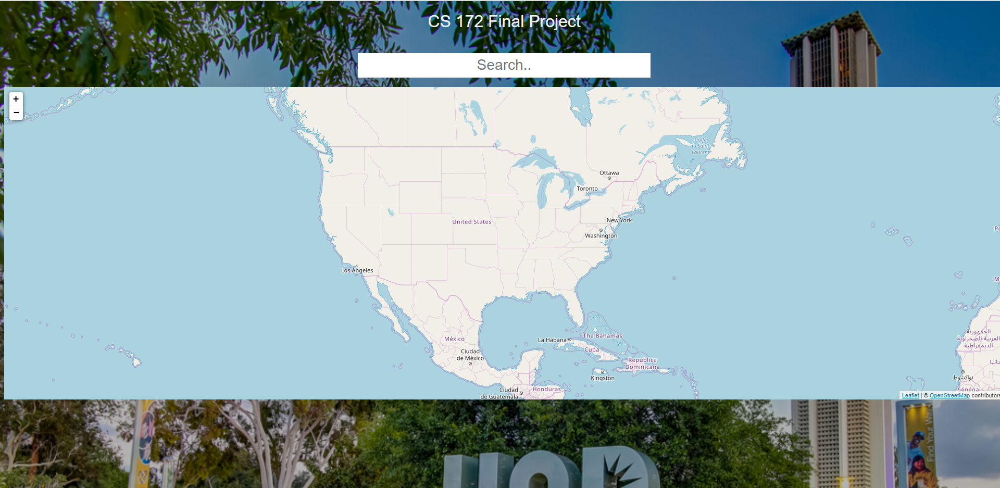
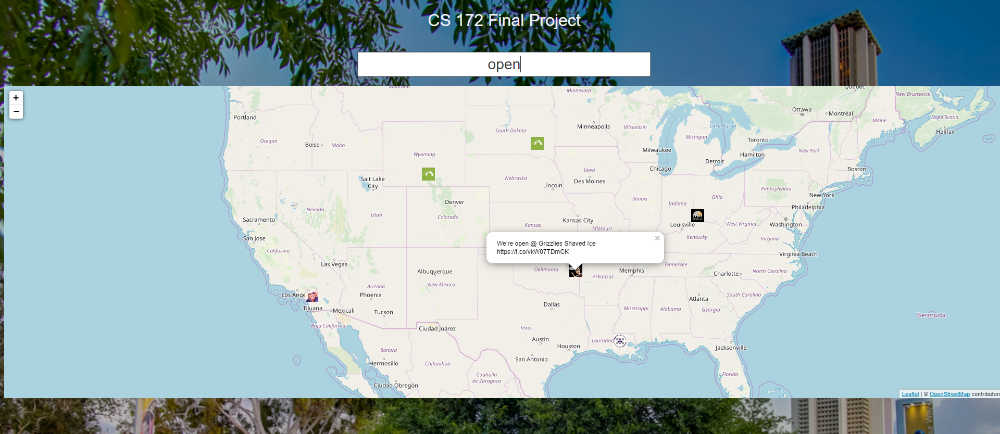

# Twitter Search Engine
Information Retrieval

### Lanaugages and Frameworks Used
* Backend: Elasticsearch, Python
* Frontend: Flask

### Capabilities
* Is able to store > 2GB of tweet data for fast retrieval. 
* Displays Latitude and Longitude of relevant tweet on a map, along with user info.
* If tweet contains a URL, a webcrawler follows the link and uses the Title of that website as the content of the tweet. 

